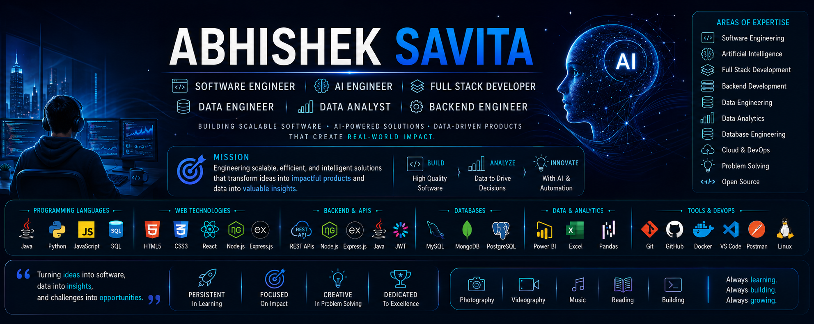

<!-- ========================================================= -->
<!--                    HERO / BRANDING                        -->
<!-- ========================================================= -->

<div align="center">



<br><br>

# 👋 Hi, I'm <a href="https://github.com/Abhishek-Savita-3012">Abhishek Savita</a>

### 💻 Software Engineer • 🤖 AI Engineer • 🌐 Full Stack Developer • ☕ Java Backend Developer • ⚙️ Data Engineer • 📊 Data Analyst


<br>

### 🚀 Transforming ideas into scalable software, intelligent AI solutions, and impactful data products.

<br>

<a href="mailto:asavita3012@gmail.com">

</a>

<a href="https://linkedin.com/in/abhishek-savita-b41961276">

</a>

<a href="https://github.com/Abhishek-Savita-3012">

</a>

<a href="https://leetcode.com/u/AbhishekSavita/">

</a>

</div>

---

<div align="center">

## 💡 Mission

> **"Building scalable software, leveraging AI to solve real-world problems, and transforming data into actionable insights."**

</div>

---

<div align="center">

## ⚡ Developer Snapshot

<table>

<tr>

<td align="center" width="25%">

💼

### Open to Work

Software Engineering

AI Engineering

</td>

<td align="center" width="25%">

🎓

### Education

B.Tech CSE

PSIT Kanpur

CGPA **8.55**

</td>

<td align="center" width="25%">

🚀

### Current Focus

Full Stack

Backend

AI

Data

</td>

<td align="center" width="25%">

🌱

### Learning

Spring Boot

System Design

Docker

Cloud

</td>

</tr>

</table>

</div>

---

<div align="center">

## 🎯 Career Vision

Designing reliable software, intelligent AI systems, and data-driven products that create meaningful impact while continuously growing as an engineer and lifelong learner.

</div>

---

<!-- ========================================================= -->
<!--                      ABOUT ME                             -->
<!-- ========================================================= -->

# 🚀 About Me


I'm **Abhishek Savita**, a **Computer Science Engineering graduate** with a passion for building **scalable software, AI-powered applications, and data-driven solutions**.

My journey began with **Java programming** and has evolved into **Full Stack Development, Backend Engineering, Artificial Intelligence, Data Engineering, and Business Analytics**. I enjoy solving real-world problems through clean architecture, thoughtful design, and continuous learning.

I believe great software isn't just about writing code—it's about creating reliable, impactful solutions that improve people's lives and help businesses make better decisions.

<br>

## 🎯 What I'm Focused On

- 💻 Building scalable software applications
- 🤖 Developing AI-powered intelligent solutions
- 🌐 Creating responsive full-stack web applications
- ☕ Designing robust Java backend systems & REST APIs
- 📊 Transforming data into actionable business insights
- ⚙️ Building modern ETL pipelines and data workflows
- ☁️ Exploring cloud technologies and scalable architectures

---

## 🌱 Currently Learning

<div align="center">

| 💡 Technology | 🚀 Goal |
|:-------------|:--------|
| ☕ Spring Boot | Enterprise Backend Development |
| 🏗️ System Design | Scalable Distributed Systems |
| 🐳 Docker | Containerized Applications |
| ☸️ Kubernetes | Cloud-native Deployment |
| ⚙️ Apache Airflow | Workflow Automation |
| 🤖 AI Agents & LLMs | Intelligent Applications |
| ☁️ AWS & OCI | Cloud Engineering |

</div>

---

## 🎓 Education

🎓 **Bachelor of Technology (Computer Science & Engineering)**

🏫 **Pranveer Singh Institute of Technology (PSIT), Kanpur**

📈 **CGPA:** **8.55 / 10**

📅 **Graduation:** **2026**

---

## 🌟 Beyond the Code

<table>
<tr>

<td align="center" width="25%">

📸

**Photography**

Capturing perspectives and telling stories through visuals.

</td>

<td align="center" width="25%">

🎥

**Videography**

Exploring creativity through cinematic content.

</td>

<td align="center" width="25%">

🧩

**Problem Solving**

Enjoy tackling challenging technical problems and algorithms.

</td>

<td align="center" width="25%">

📚

**Continuous Learning**

Always exploring emerging technologies and industry trends.

</td>

</tr>
</table>

---

## 🤝 Looking For

I'm currently open to opportunities and collaborations in:

- 💼 Software Engineering
- 🤖 Artificial Intelligence
- 🌐 Full Stack Development
- ☕ Java Backend Development
- ⚙️ Data Engineering
- 📊 Data Analytics & Business Intelligence
- 🚀 Open Source Contributions

---

> ### 💭 My Philosophy
>
> **"Technology has the greatest impact when software engineering, artificial intelligence, and data work together to solve meaningful real-world problems."**

---

<!-- ========================================================= -->
<!--                    TECH ARSENAL                           -->
<!-- ========================================================= -->

# ⚡ Tech Arsenal

<div align="center">

*"Building modern applications with the right technologies for the right problems."*

</div>

---

## 💻 Programming Languages

<div align="center">


</div>

---

## 🌐 Full Stack Development

<div align="center">

### 🎨 Frontend


<br><br>

### ⚙️ Backend


<br>


</div>

---

## 🗄️ Databases

<div align="center">


</div>

---

## 📊 Data Engineering & Analytics

<div align="center">


</div>

---

## 🤖 Artificial Intelligence

<div align="center">


</div>

---

## ☁️ Cloud • DevOps • Tools

<div align="center">


<br><br>


</div>

---

# 🎯 Core Expertise

<div align="center">

| 💻 Software Engineering | 🤖 AI Engineering | 📊 Data & Analytics |
|:------------------------|:------------------|:--------------------|
| Java Development | Generative AI | Power BI |
| Backend Development | NLP | SQL |
| REST APIs | Prompt Engineering | Excel |
| OOP & Design | AI Applications | Pandas |
| Full Stack Development | LLM Integration | ETL Pipelines |

</div>

---

## 🚀 Currently Exploring

<div align="center">

| 🌱 Technology | 📌 Purpose |
|:--------------|:-----------|
| Spring Boot | Enterprise Java Development |
| Docker | Containerized Applications |
| Kubernetes | Cloud-Native Deployment |
| Apache Airflow | Workflow Orchestration |
| System Design | Scalable Architectures |
| AI Agents | Autonomous AI Systems |

</div>

---

<!-- ========================================================= -->
<!--                 FEATURED PORTFOLIO                        -->
<!-- ========================================================= -->

# 🚀 Featured Portfolio

<div align="center">

*"A collection of projects demonstrating software engineering, artificial intelligence, full stack development, data engineering, and business analytics."*

</div>

<br>

# 🤖 Artificial Intelligence

<table>

<tr>

<td width="50%">

### 🤖 Document Summary Assistant

AI-powered application that intelligently summarizes lengthy documents using Natural Language Processing and modern AI techniques.

**✨ Highlights**

- Intelligent document summarization
- NLP-powered text processing
- Fast & efficient summaries
- Clean user interface

**🛠 Tech Stack**

Python • NLP • AI • Streamlit

<br>

<a href="https://github.com/Abhishek-Savita-3012/Document_Summary_Assistant">


</a>

</td>

<td>


</td>

</tr>

</table>

---

<table>

<tr>

<td>


</td>

<td width="50%">

### 📈 Customer Churn Prediction & Retention Analytics

Machine Learning project predicting customer churn and providing actionable retention strategies.

**✨ Highlights**

- Customer churn prediction
- Machine Learning pipeline
- Business recommendations
- Interactive dashboard

**🛠 Tech Stack**

Python • Scikit-Learn • Pandas • Power BI

<br>

<a href="https://github.com/Abhishek-Savita-3012/Customer-Churn-Prediction-and-Retention-Analytics">


</a>

</td>

</tr>

</table>

---

# ⚙️ Data Engineering & Analytics

<table>

<tr>

<td width="50%">

### ⚙️ ETL Pipeline with PostgreSQL

Enterprise-style ETL pipeline automating extraction, transformation, validation, and loading of business datasets.

**✨ Highlights**

- ETL workflow
- PostgreSQL integration
- Data validation
- Automation ready

**🛠 Tech Stack**

Python • PostgreSQL • SQL • ETL

<br>

<a href="https://github.com/Abhishek-Savita-3012/etl-pipeline-postgresql">


</a>

</td>

<td>


</td>

</tr>

</table>

---

<table>

<tr>

<td>


</td>

<td width="50%">

### 🛒 Retail Sales & Inventory Analytics

Enterprise analytics solution featuring KPI dashboards, customer segmentation, inventory optimization, and sales forecasting.

**✨ Highlights**

- Executive Dashboard
- RFM Segmentation
- ABC Inventory Analysis
- Sales Forecasting

**🛠 Tech Stack**

SQL • Python • Power BI • Excel

<br>

<a href="https://github.com/Abhishek-Savita-3012/Retail-Sales-Inventory-Analytics">


</a>

</td>

</tr>

</table>

---

<table>

<tr>

<td width="50%">

### 🏠 Airbnb Global Performance Dashboard

Business Intelligence dashboard analyzing Airbnb listings, pricing trends, occupancy, and host performance.

**✨ Highlights**

- Interactive Dashboard
- KPI Tracking
- Global Analysis
- Business Insights

**🛠 Tech Stack**

Power BI • DAX • Excel

<br>

<a href="https://github.com/Abhishek-Savita-3012/Airbnb-Global-Performance-Dashboard">


</a>

</td>

<td>


</td>

</tr>

</table>

---

# 💻 Software Engineering

<table>

<tr>

<td>


</td>

<td width="50%">

### 🏦 Banking Management System

Java application implementing customer management, secure banking operations, and relational database integration.

**✨ Highlights**

- Banking Operations
- OOP Design
- JDBC Integration
- MySQL Database

**🛠 Tech Stack**

Java • JDBC • MySQL

<br>

<a href="https://github.com/Abhishek-Savita-3012/Banking-Management-System">


</a>

</td>

</tr>

</table>

---

<table>

<tr>

<td width="50%">

### 💬 Java Chat Application

Real-time multi-client chat application built using Socket Programming and Multithreading.

**✨ Highlights**

- Live Chat
- Multiple Clients
- Socket Programming
- Multithreading

**🛠 Tech Stack**

Java • TCP/IP • Socket Programming

<br>

<a href="https://github.com/Abhishek-Savita-3012/Java-Chat-Application">


</a>

</td>

<td>


</td>

</tr>

</table>

---

<table>

<tr>

<td>


</td>

<td width="50%">

### 📊 Code Profile Analysis

Developer analytics platform providing insights into coding activity, problem-solving progress, and technical growth.

**✨ Highlights**

- Coding Analytics
- API Integration
- Progress Tracking
- Interactive Dashboard

**🛠 Tech Stack**

Java • JavaScript • HTML • CSS

<br>

<a href="https://github.com/Abhishek-Savita-3012/Code-Profile-Analysis">


</a>

</td>

</tr>

</table>

---

<!-- ========================================================= -->
<!--          CERTIFICATIONS & PROFESSIONAL GROWTH             -->
<!-- ========================================================= -->

# 🏆 Certifications & Professional Growth

<div align="center">

*"Continuously expanding my knowledge across software engineering, artificial intelligence, cloud computing, and data analytics."*

</div>

---

## 🤖 Artificial Intelligence

<div align="center">

| Certification | Provider |
|:-------------|:---------|
| 🟣 Claude AI Fluency: Framework & Foundations | Anthropic |
| 🟣 Claude 101 | Anthropic |

</div>

---

## 💻 Software Engineering

<div align="center">

| Certification | Provider |
|:-------------|:---------|
| 🟠 Java (Basic) | HackerRank |
| 🔴 Oracle Dev Gym | Oracle |
| 🟢 Infosys Springboard Certifications | Infosys |

</div>

---

## 📊 Data Analytics

<div align="center">

| Certification | Provider |
|:-------------|:---------|
| 🔵 Data Classification | IBM SkillsBuild |
| 🔵 Data Collection & Analysis | IBM SkillsBuild |
| 🔵 Data Preparation for Analysis | IBM SkillsBuild |
| 🔵 Data Usability | IBM SkillsBuild |
| 🔵 Data Visualization & Presentation | IBM SkillsBuild |
| 🔵 Inferential & Descriptive Statistics | IBM SkillsBuild |

</div>

---

## ☁️ Cloud Computing

<div align="center">

| Certification | Provider |
|:-------------|:---------|
| 🔴 Oracle Cloud Infrastructure Foundations Associate | Oracle |
| 🟡 AWS Security Fundamentals | Amazon Web Services |

</div>

---

# 🎯 Knowledge Areas

<div align="center">

| 💻 Software Engineering | 🤖 Artificial Intelligence | 📊 Data & Analytics | ☁️ Cloud |
|:-----------------------|:--------------------------|:-------------------|:---------|
| Java | Generative AI | Power BI | Oracle Cloud |
| OOP | Prompt Engineering | SQL | AWS |
| REST APIs | LLM Applications | Excel | Cloud Fundamentals |
| Backend Development | Claude AI | Pandas | Security |

</div>

---

## 📈 Continuous Learning Journey

```text
2024
│
├── Java & SQL Foundations
├── Oracle Dev Gym
├── IBM Data Analytics
│
2025
│
├── Power BI & Business Intelligence
├── AWS Security Fundamentals
├── Oracle Cloud Infrastructure
│
2026
│
├── Claude AI Fluency
├── Claude 101
├── AI Applications
├── System Design
└── Full Stack Development
```

---

## 🌱 Currently Upskilling

- ☕ Enterprise Java with Spring Boot
- 🌐 MERN Stack Development
- 🏗️ System Design & Scalable Architectures
- 🐳 Docker & Containerization
- ☁️ Cloud Computing
- 🤖 AI Agents & LLM Applications
- ⚙️ Apache Airflow & Data Pipelines
- 🚀 Open Source Development

---

> **"I believe learning is a continuous journey. Every certification represents not just completed coursework, but another step toward building better software, intelligent AI solutions, and impactful data-driven products."**

---

<!-- ========================================================= -->
<!--              GITHUB & DEVELOPER DASHBOARD                 -->
<!-- ========================================================= -->

# 📊 GitHub & Developer Dashboard

<div align="center">

*"Building consistently. Learning continuously. Growing every day."*

</div>

---

## 🚀 Developer Snapshot

<div align="center">

| 💻 Focus | 🎯 Status | 🌱 Learning | 🤝 Open To |
|:---------|:----------|:------------|:-----------|
| Software Engineering | Open to Opportunities | Spring Boot & System Design | Collaboration & Open Source |

</div>

---

## 💼 Development Domains

<div align="center">

| 🚀 Domain | 💡 Technologies |
|:----------|:----------------|
| 💻 Software Engineering | Java • OOP • REST APIs • JDBC |
| 🌐 Full Stack Development | HTML • CSS • JavaScript • Node.js • Express.js |
| 🤖 Artificial Intelligence | Generative AI • NLP • Prompt Engineering • LLMs |
| 📊 Data Analytics | SQL • Python • Power BI • Excel • Pandas |
| ⚙️ Data Engineering | PostgreSQL • ETL • Apache Airflow |
| ☁️ Cloud & DevOps | Git • Docker • Linux • OCI • AWS |

</div>

---

## 📈 GitHub Activity

<div align="center">


</div>

---

## 🎯 2026 Developer Goals

<div align="center">

| 🎯 Goal | Progress |
|:---------|:---------|
| 💻 Build Production-Ready Software | 🟦🟦🟦🟦⬜ |
| 🤖 Create AI Applications | 🟦🟦🟦⬜⬜ |
| 🌐 Master Full Stack Development | 🟦🟦🟦⬜⬜ |
| ☕ Become Strong Java Backend Engineer | 🟦🟦🟦🟦⬜ |
| 📊 Advance Data Engineering Skills | 🟦🟦🟦⬜⬜ |
| 🌟 Contribute to Open Source | 🟦🟦⬜⬜⬜ |

</div>

---

## 📚 Current Learning Roadmap

```text
Software Engineering
███████████████████░░

Java Backend
██████████████████░░░

Full Stack
███████████████░░░░░░

Artificial Intelligence
████████████████░░░░░

Data Engineering
██████████████░░░░░░░

System Design
███████████░░░░░░░░░░

Cloud Computing
█████████░░░░░░░░░░░░
```

---

## 📅 Developer Journey

```text
2022  ─────────────── Started B.Tech (CSE)

        │

2023  ─────────────── Java • SQL • OOP

        │

2024  ─────────────── Data Analytics & Power BI

        │

2025  ─────────────── Full Stack • Backend • ETL

        │

2026  ─────────────── AI • System Design • Open Source
```

---

## 👀 Profile Visitors

<div align="center">


</div>

---

<!-- ========================================================= -->
<!--                 DEVELOPER JOURNEY                         -->
<!-- ========================================================= -->

# 🚀 Developer Journey

<div align="center">

*"Every project, every challenge, and every line of code has contributed to the engineer I'm becoming."*

</div>

---

## 🕒 My Journey

```text
🎓 2022
━━━━━━━━━━━━━━━━━━━━━━━━━━━━━━━━━━━━━━━━━━━━━━━━━━━━━━━━━━━━

Started my Computer Science Engineering journey.

• Built strong programming fundamentals
• Learned Java, SQL, and problem-solving
• Developed a passion for software development

                 │
                 ▼

💻 2023
━━━━━━━━━━━━━━━━━━━━━━━━━━━━━━━━━━━━━━━━━━━━━━━━━━━━━━━━━━━━

Strengthened my Software Engineering foundation.

• Object-Oriented Programming
• Java Development
• JDBC & MySQL
• Git & GitHub
• Clean coding practices

                 │
                 ▼

📊 2024
━━━━━━━━━━━━━━━━━━━━━━━━━━━━━━━━━━━━━━━━━━━━━━━━━━━━━━━━━━━━

Explored the world of Data.

• SQL for Analytics
• Python & Pandas
• Power BI Dashboards
• Business Intelligence
• Data Visualization

                 │
                 ▼

🚀 2025
━━━━━━━━━━━━━━━━━━━━━━━━━━━━━━━━━━━━━━━━━━━━━━━━━━━━━━━━━━━━

Expanded into Modern Development.

• Full Stack Development
• Backend Engineering
• ETL Pipelines
• Machine Learning
• Real-world Projects
• REST APIs

                 │
                 ▼

🤖 2026
━━━━━━━━━━━━━━━━━━━━━━━━━━━━━━━━━━━━━━━━━━━━━━━━━━━━━━━━━━━━

Currently Growing As An Engineer.

• Artificial Intelligence
• LLM Applications
• Spring Boot
• System Design
• Cloud Computing
• Open Source Contributions
```

---

# 💡 Engineering Philosophy

<div align="center">

### **"Great software is built by combining strong engineering principles, continuous learning, and a genuine desire to solve real-world problems."**

</div>

I enjoy creating technology where **software engineering**, **artificial intelligence**, and **data** come together to deliver practical, scalable, and impactful solutions. Every project is an opportunity to improve not only my technical skills but also my approach to designing reliable and user-focused applications.

---

# 🚀 Career Vision

I aspire to become a well-rounded engineer capable of building **scalable software systems**, **AI-powered applications**, and **data-driven products** that create meaningful impact.

My goal is to continuously grow as a developer by embracing modern technologies, contributing to open-source projects, collaborating with talented teams, and solving increasingly complex engineering challenges.

---

# 💬 A Few Things About Me

<table>
<tr>

<td align="center" width="25%">

### 💻

**Builder**

I enjoy transforming ideas into real-world applications through clean, maintainable code.

</td>

<td align="center" width="25%">

### 🧩

**Problem Solver**

I love tackling challenging problems and continuously improving my analytical thinking.

</td>

<td align="center" width="25%">

### 📸

**Creative Mind**

Photography and videography inspire me to approach technology with creativity and attention to detail.

</td>

<td align="center" width="25%">

### 🚀

**Lifelong Learner**

I'm always curious about emerging technologies and excited to explore new ideas that help me grow as an engineer.

</td>

</tr>
</table>

---

<div align="center">

## 🌟 Looking Ahead

**Building today with curiosity.  
Learning continuously with purpose.  
Growing into an engineer who creates technology that makes a meaningful difference.**

</div>

---

## 📄 Resume

Interested in my skills and experience?

<a href="https://drive.google.com/file/d/1LqwXYug7xR3XMbwo9ODCsEMCoYpQmeQD/view?usp=sharing">

</a>


## 🤝 Let's Connect

I am open to opportunities in **Data Analytics, Business Intelligence, Software Development, and Data-driven projects**.

Feel free to connect with me for collaboration, discussions, or professional opportunities.

<p align="center">

<a href="mailto:asavita3012@gmail.com">

</a>

<a href="https://linkedin.com/in/abhishek-savita-b41961276">

</a>

<a href="https://github.com/Abhishek-Savita-3012">

</a>

</p>


<p align="center">
⭐ Thanks for visiting my profile! Feel free to explore my repositories and connect.
</p>
